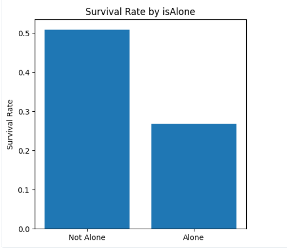

# Titanic Data Engineering Project (PySpark on Databricks)

## 📌 Project Overview
This project uses the Titanic dataset to practice **data engineering fundamentals** in PySpark on Databricks.  
The workflow demonstrates:
- Data ingestion
- Data cleaning & handling missing values
- Feature engineering
- Exploratory data analysis (EDA)
- Preparing dataset for Machine Learning

---

## 🛠️ Tech Stack
- **PySpark** (DataFrame API, SQL functions, MLlib)
- **Databricks Community Edition**
- **Matplotlib / Pandas** for visualization

---

## 🔑 Key Steps

1. **Data Ingestion**
   - Loaded Titanic dataset into Spark DataFrame
   - Inspected schema and data quality

2. **Data Cleaning**
   - Checked null values per column
   - Filled missing values in `Age`, `Fare`, `Embarked`
   - Created `hasCabin` flag for missing Cabin info

3. **Feature Engineering**
   - Extracted passenger **Title** from Name
   - Created **FamilySize** (`SibSp + Parch + 1`)
   - Added **isAlone** flag

4. **Exploratory Analysis**
   - Calculated survival rates by:
     - Sex
     - Pclass
     - Age group
     - Family size
     - isAlone flag
     - Embarked location
   - Visualized some results using Pandas + Matplotlib

5. **Data Preparation for ML**
   - Indexed categorical columns (`Sex`, `Embarked`, `Title`)
   - Assembled clean numeric dataset (`df_numeric`)
   - (Saving to Parquet/CSV skipped due to DBFS restriction in Community Edition)

---

## 📊 Insights
- Female passengers had a much higher survival rate.
- First-class passengers survived more often than third-class.
- Traveling with small family groups had higher survival chances vs being alone.
- Titles like *Mrs* and *Miss* correlated with higher survival rates.

---

## 🚀 Next Steps
- Try on other datasets (e.g., e-commerce, flights data)
- Automate pipeline using PySpark functions
- Deploy in production environment (future projects)

---

## 📂 Repo Structure
├── titanic_data_engineering.ipynb # Main notebook

└── README.md # Project documentation

## Visualizations
# Survival Rate by isAlone

